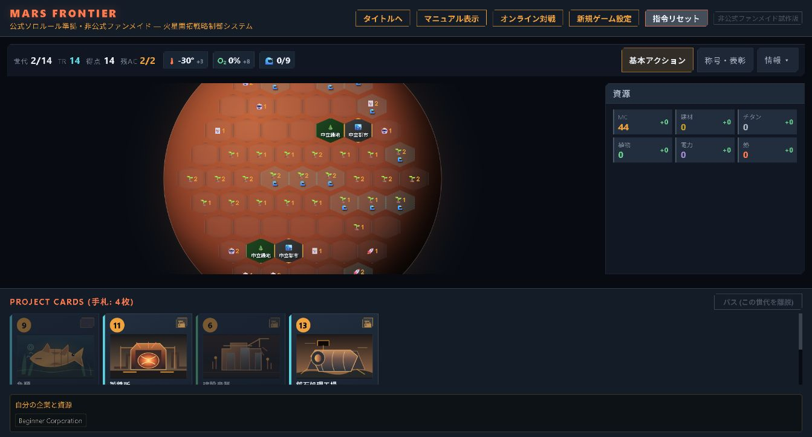
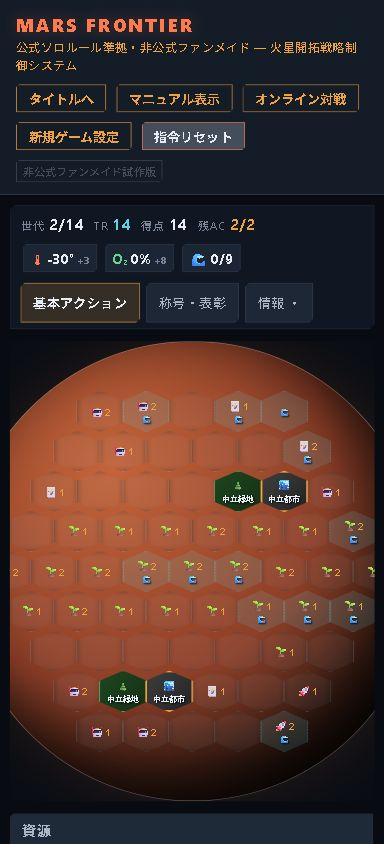

# MARS FRONTIER 引き継ぎ監査報告書

監査日：2026年9月8日  
対象：`C:\Users\takkun\Documents\mars-frontier`  
監査基準コミット：`6e7fe84c18cde2ae1a30ca19ead18f49e21087e2`（main）  
実画面：Cloudflare Workers公開版をChromeで操作  
成果物：監査報告、再現スクリプト、実行ログ、画面画像。ゲーム本体の修正・公開は今回の対象外。

## 1. 結論

**基本的な対戦進行と多数のカード効果は実装されているが、現状を「原作の完全再現」と評価することはできない。**
不足しているのはカード枚数だけではない。
マップごとの表彰、初期セットアップで利用できる情報、Preludeの購入判定に、戦略と勝敗を変える差がある。
UIでは、通常のデスクトップ画面でカード本文や盤面の一部が隠れ、操作の前提となる情報を読み取りにくい。

今回、既存の667テスト、オンラインを含む10本のE2E、型検査、lintはすべて成功した。
それでも以下の問題を再現したため、**テスト成功と原作への忠実さを別々に管理する必要がある。**

| 優先 | 改善対象 | 現状の問題 | 先に行う対応 |
|---|---|---|---|
| P0 | エリシウム・アマゾニス・ユートピア | 表彰セットや判定値が公式と異なる。アマゾニスは盤面仕様も異なる | 公式資料を基準にマップ定義と終局条件を修正 |
| P0 | 初期セットアップ | 企業選択時に手札を比較できない。未選択Preludeの費用で購入を拒否 | 企業・初期手札・Preludeを同じ画面で選択し、一括確定 |
| P0 | デスクトップの盤面・手札 | 盤面の上下が欠け、カード本文が初期表示から外れる | 可読領域を確保し、カード詳細を常時開けるようにする |
| P1 | 拡張の選択 | Preludeを有効にするとPrelude 2も入る | 拡張を独立して選択・表示 |
| P1 | 初心者企業 | 0枚選択でも開始でき、無料の初期10枚を失う | 10枚を自動保持する専用経路 |
| P1 | ガイド・キーボード操作 | ソロ固定説明、背面へ移るフォーカス | 試合設定に応じた説明とモーダルのフォーカス管理 |
| P2 | 公式バリエーションと追加商品 | TRソロ等を選べない。再現対象の版・商品一覧がない | 対応表を作り、対象に含めるものから実装 |

P0は「新機能を追加する前に直す項目」、P1は「日常的に遊びやすくする項目」、P2は「再現範囲を広げる項目」を表す。
脆弱性の深刻度区分ではない。

## 2. 監査範囲と判定方法

本報告では、原作をボードゲーム **Terraforming Mars** とし、まず現在のUIが提供する基本セット、Prelude、Prelude 2、Venus Next、Colonies、Turmoil、プロモ、5マップを照合対象とした。
原作のルール、収録内容、表記・図柄は別々に扱う。
独自のカードアートやSF風UIがあること自体はルール不一致ではない。
ただし原作と同じ図柄まで求める場合、現在の独自SVGはその要件を満たさない。

判定は以下の3種類とした。

- **確認済みの不一致**：公式資料とコードを照合し、関数実行または画面操作で差を確認したもの。
- **未実装・未提供**：設定や実装経路がなく、選べないもの。既存機能の故障とは区別する。
- **未検証・改善提案**：今回の観測だけでは正否を確定できないもの、利用しやすさを高める設計案。

`HANDOVER.md`を引き継ぎの主資料とし、`HANDOFF.md`、CI、テスト、監査スクリプト、主要ソースも参照した。
古い引き継ぎ書には、現在は修正済みのオンラインや世界的イベントが未実装として残っている。
それらを今回の不足項目として再掲していない。
参照OSSは独立した非公式実装であり、公式ルールの代わりにはしない。

公開画面の観測とローカルHEADの検査は区別した。
今回、配信バンドルとHEADの完全一致までは検査していない。
Chromeでは新規ソロの設定、企業選択、初期購入、世代2への進行、研究購入、カード選択、標準プロジェクトのドロワー、キーボードフォーカスを確認した。
本番オンラインの全世代完走や、全カードの手動プレイは実施していない。

## 3. 原作再現に関する確認済みの不一致

### R1. エリシウムの表彰がヘラスと同じになっている【P0】

`app/board-milestones.js:147`は、エリシウムの表彰にヘラスの配列をそのまま代入している。
現在の取得結果は `cultivator / magnate / space-baron / excentric / contractor` である。

公式のエリシウムはCelebrity、Industrialist、Desert Settler、Estate Dealer、Benefactorの5種である。
それぞれ高コストカード、建材と電力の保有資源、南側への配置、海洋隣接、TRを評価するため、現在の実装とは狙う戦略も最終得点も変わる。[公式Hellas & Elysium説明書](https://fryxgames.se/wp-content/uploads/2023/07/TM_HE_WRAP_ENGi.pdf)

**必要な対応**：エリシウム専用の表彰定義と集計を実装する。
資源と生産量の取り違え、イベント除外、南側4列、海洋が複数隣接する場合の数え方も境界事例で検証する。
現在の「5項目ある」というテストに加え、公式の5種と評価値を照合するテストが必要である。

### R2. アマゾニスが公式Amazonis Planitiaの仕様を再現していない【P0】

実行結果ではアマゾニスは61マスで、称号と表彰はユートピアの配列を共有する。
`scripts/generate-boards.mjs`は全マップを9行・61マスで生成し、`tests/alternate-boards.test.mjs:19`も全マップ61マスを正解としている。
終局判定 `app/game-logic.js:8211`は気温+8℃・酸素14%・海洋9枚の共通判定であり、マップ別の引数を持たない。

公式Amazonisは広い盤面と長いパラメータトラックを特徴とする。
公式の称号はTerran、Landshaper、Merchant、Sponsor、Lobbyistであり、表彰もCollectorなど固有の5種である。
追加海洋タイルや専用標準プロジェクト、任意の長い金星トラックも付属する。[公式Amazonis & Vastitas商品説明](https://fryxgames.se/product/terraforming-mars-amazonis-vastitas/)

**必要な対応**：公式版の盤面・配置ボーナス・称号・表彰・トラック・閾値ボーナス・終了条件を一組の定義として取り直す。
既存データが別版やファンマップ由来なら、その名前と版を明示して公式Amazonisと分離する。
全マップ61マスを固定する生成処理とテストも改める。
今回、公式盤面全マスの転記監査は行っていないため、正しい座標表やトラック上限の完全な一覧は未作成である。

### R3. ユートピアの低コストカード表彰の上限が誤っている【P0】

`app/board-milestones.js:132`付近は「起業家」をコスト19 MC以下で集計する。
関数にコスト10・11・19・20のカードを1枚ずつ与えると、結果は1・1・1・0となった。

公式Incorporatorは**10 MC以下**を対象とする。
11～19 MCのカードを含める現在の条件は表彰順位を変える。[公式Utopia & Cimmeria説明書](https://fryxgames.se/wp-content/uploads/2024/09/TM_UA_WRAP_ENG.pdf)

**必要な対応**：上限を直し、10と11の境界を公式資料から固定する。
名称も公式英名との対応を整理する。
さらにイベントを含む「プレイしたカード」の扱いを確認する必要がある。
現関数は`playedProjects`だけを走査しており、`playedEvents`を別保管する設計との整合は追加検証対象となる。

### R4. 初期セットアップが、原作で可能な同時比較を妨げる【P0】

Chromeの企業選択画面には企業2枚が表示され、初期手札欄は0枚だった。
企業を確定すると初めて10枚の購入候補が表示された。
企業候補では名称・タグ・効果は読めるが、候補ごとの初期MC・資源・生産量を比較する一覧がない。
`app/page.tsx:2098`以降の分岐も、企業、Prelude、プロジェクトを`setupStep`ごとに分けて表示している。

原作では企業と初期プロジェクトを比較して選び、Prelude使用時はPrelude2枚も同時に選ぶ。
企業を先に確定させると、資源の相性やタグの組合せを考えるための情報が失われる。[基本ルールの出版社作成PDF・ミラー、p.7](https://esltqdkllporgkecoqih.supabase.co/storage/v1/object/public/rulebooks/terraforming_mars_c34530d2.pdf)、[Prelude説明書・出版社作成PDFのミラー、p.2](https://gamers-hq.de/media/pdf/ce/55/4d/TM_PRELUDE_RULES.pdf)

**必要な対応**：企業2枚、初期10枚、Prelude4枚を一つのセットアップ画面で比較できるようにする。
確定前は選択を自由に変更でき、選択企業の初期資源、購入後残高、選んだPreludeの処理順を表示する。
他プレイヤーへの公開は確定タイミングに合わせ、オンラインとホットシートでは未確定情報を隠す。

### R5. 選ばないPreludeの費用まで確保させ、合法な購入を拒否する【P0】

`app/game-command.js:1420`付近の`BUY_RESEARCH`は、提示されたPrelude4枚を費用の高い順に並べ、その上位2枚分を残すことを要求する。
プレイヤーが選ぶ2枚ではない。

次の局面をローカルのコマンドで再現した。

| 項目 | 値 |
|---|---|
| 所持MC | 30 |
| 購入したいプロジェクト | 7枚、計21 MC |
| 購入後残高 | 9 MC |
| 提示Prelude | Business Empire（6）、Galilean Mining（5）、Acquired Space Agency（0）、Allied Banks（0） |
| 選択可能な組合せ | 費用0の2枚 |
| 実際の結果 | `CANNOT_AFFORD`、「Preludeの支払いに11 MCを残す必要があります。」 |

これは未選択カードの費用が購入を制限する問題である。
原作の同時選択手順とも一致しない。[Prelude説明書、p.2](https://gamers-hq.de/media/pdf/ce/55/4d/TM_PRELUDE_RULES.pdf)

**必要な対応**：R4の一括選択に合わせ、実際に選んだ2枚と解決順に基づいて検査する。
単に「安い2枚の合計」に置き換えるだけでは、先に資金を得る効果などを正しく扱えない。
購入、Preludeの選択、支払いと獲得の順序を通した検証が必要である。

### R6. 初心者企業で、初期10枚を無料保持せず0枚でも開始できる【P1】

ChromeでBeginner Corporationを選び、初期購入候補を何も選択せず「購入を確定する」を押すと、手札0枚・42 MCでアクションフェーズへ進んだ。
ローカルでも、初心者企業に対する`BUY_RESEARCH`へ空の`cardIds`を渡すと`ok: true`、`phase: action`、手札0枚となった。

原作の初心者企業は42 MCと10枚の初期手札を受け取る。
現在は「初期10枚を無料で保持する」という自分自身の説明にも反する操作が可能である。[基本ルール、p.7](https://esltqdkllporgkecoqih.supabase.co/storage/v1/object/public/rulebooks/terraforming_mars_c34530d2.pdf)

**必要な対応**：初心者企業は初期10枚を自動保持し、購入選択を省略する。
また、現在は通常の企業候補に初心者企業が混ざるため、原作どおりの初心者向け選択方式と通常企業の配布を整理する。
第2世代以降の購入画面にも「Beginner Corporationは無料」と出るが、実際の4枚購入額は12 MCだった。
無料という説明は初期セットアップ時だけ表示する。

### R7. PreludeとPrelude 2を独立して選択できない【P1】

`enabledExpansions({ prelude: true })`の実行結果は`base / prelude / prelude2`である。
`app/game-logic.js:7059`付近で2つを一緒に有効化するが、画面のチェックボックス名は「プレリュード (Prelude)」だけである。
そのため「基本＋Prelude」の箱構成をそのまま再現できない。

**必要な対応**：Prelude、Prelude 2、プロモを独立した設定として保存・配信する。
カード単位の拡張依存関係フィルターは既存実装を活用し、各構成で山札に入るID集合を検証する。
設定には有効な拡張と含まれるカード数を表示する。

## 4. 完全再現に向けて不足する範囲と証拠

### 4.1 未提供の公式ルール・商品を対応表にする

| 対象 | 現状と扱い | 必要な作業 |
|---|---|---|
| TRソロ | TR63勝利と緩衝ガス16 MC→TR+1を選ぶ設定・処理がない | 勝利条件の選択、標準プロジェクト、12/14世代の判定、セーブ・オンライン設定の対応 |
| 標準ゲーム／Corporate Era | 現設定には区別がない。初期生産とカード集合を商品・モード別に選ぶ経路がない | どの版を標準とするかを明示し、初期条件とカード集合を分離 |
| 初期ドラフト／研究ドラフト | 現在は1つの設定で初期10枚と世代ごとのドラフトが連動 | 通常の研究ドラフトと初期ドラフトを分けて選択・説明 |
| Terra Cimmeria／Vastitas Borealis | 現在の5マップ一覧にない | 全公式マップを対象に含める場合に追加。まず既存マップの誤りを修正 |
| 公式Automa | 現在の3難易度ボットを公式Automaと同一とは評価できない | 対象に含めるなら専用ルール・データ・得点計算を別管理 |
| プロモの年度・版 | 428プロジェクトという総数だけでは収録範囲が特定できない | 商品、年度、カード番号、出典、対応状況を列挙 |
| 原作の日本語名・図柄 | 企業の英語表示、独自アート、建材／鋼鉄／鋼材などの表記が混在 | 公式日本語版との用語対応表、図柄を合わせる範囲、素材の出所を整理 |

TRソロとPreludeの世代数は[Prelude説明書p.3](https://gamers-hq.de/media/pdf/ce/55/4d/TM_PRELUDE_RULES.pdf)、標準ゲームとCorporate Eraの区分は[基本ルールp.7・13](https://esltqdkllporgkecoqih.supabase.co/storage/v1/object/public/rulebooks/terraforming_mars_c34530d2.pdf)に基づく。
追加マップは[Utopia & Cimmeria説明書](https://fryxgames.se/wp-content/uploads/2024/09/TM_UA_WRAP_ENG.pdf)と[Amazonis & Vastitas商品説明](https://fryxgames.se/product/terraforming-mars-amazonis-vastitas/)で確認した。
公式Automaは[専用ルールブック](https://fryxgames.se/wp-content/uploads/2024/09/TM-Automa-rulebook-A-08-15-2023.pdf)を持つ別の対象である。
この表は確認した追加対象であり、将来商品を含む全商品の網羅一覧ではない。

Political Agendasなど参照OSS由来の追加機能は、正式な再現対象を決めるまでは基本Turmoilの欠落として数えない。
現在の標準Turmoilには世界的イベント36種の効果や政党交代が実装されており、旧引き継ぎ書の「イベント効果未実装」をそのまま信じるべきではない。

### 4.2 「未実装0枚」と「全効果が正しい」を分ける

| 検証 | 今回の実測 | 証明していない範囲 |
|---|---|---|
| カタログ | プロジェクト428、Prelude70、企業49 | 公式商品全体の収録完了 |
| 未実装登録 | 0枚、監査上の問題0 | 全カードの全局面での正しさ |
| 数値契約 | プロジェクト211、Prelude47、企業49が成功 | プロジェクト217、Prelude23はこの数値契約の対象外 |
| 上流の宣言的効果 | 358一致、差0、72スキップ | 手書き効果など比較できないもの |
| 上流操作の差分再生 | 2,862操作中464を再生、464一致、差0 | 2,398操作は未再生 |
| 上流の可否・行動・得点ケース | 265／75／36ケースが一致 | 抽出できなかった164／80／91ブロック |
| 継続効果監査 | 30成功、7件はこの監査で観測できない | 継続効果すべての自動網羅 |
| スキップ台帳 | 455件に代替検証の担当がある | 元テストと同じ条件・問いを検査している保証 |

差分再生率は約16.2%であるが、**これはゲームの再現率ではない**。
操作数には重複や重みの違いがあり、未再生だから未実装とも言えない。
ただし、既存カードが置かれた局面611件、企業・Prelude469件、与党条件292件、配置済みタイル181件、相手の資源40件などは、今後の比較範囲として具体的に残る。

優先すべき追加検証は、効果の解決順、攻撃対象と防御、支払い後に発生する選択、選択途中の保存・再接続、拡張横断、3～5人の同時選択、終局得点の独立再計算である。
今回のマップ誤りのように、誤った定義をそのままテストに複写するだけでは見逃す。
期待値には公式資料のページと具体例を添える必要がある。

## 5. ユーザーに使いやすいUIにするための改善

### U1. 盤面とカード本文の可視領域を先に確保する【P0・実画面確認】

初回の通常Chrome表示は約1343×725だった。
世代2・手札4枚の画面で盤面の上下が欠け、手札はアートとカード名付近までしか初期表示されなかった。
DOM測定ではカード本体が約234px、手札スクロール領域が約119px、本文は9.5pxだった。
カード名・効果・得点を読むにはカード欄内の縦スクロールが必要となる。



`100dvh`に盤面、資源、手札、企業情報を押し込む構成と、手札領域の高さ配分が衝突している。
`app/expansion-ui.css:969`にはカード側の`--card-w: 148px`もあり、親から渡す可変幅を受ける設計との整合を確認すべきである。
今回の測定では親子とも148pxだったため、この上書きだけを表示欠けの実証済み原因とはしない。

**改善案**：盤面は全合法マスが見えるよう表示領域から倍率を計算し、任意の拡大・移動・全体表示を用意する。
手札は横スクロールと一覧表示を選べるようにし、カードを選ぶと別の固定領域に効果全文を表示する。
ウィンドウの高さが不足する場合は、情報を切り落とさず、折りたたみか明示的なページスクロールへ切り替える。

**完了条件**：1366×768、1920×1080で、通常時とカード選択時の両方について、盤面全体へ到達でき、カード全文・支払い・実行ボタンが読める。
200%拡大でも情報や操作が失われないことを確認する。

### U2. カードを選べば、本文・条件・得点根拠を読めるようにする【P1・画面／コード確認】

製鉄所を選択すると、選択中の名称、タグ、実質コスト、実行ボタンは表示された。
しかし選択パネルに効果全文を大きく再表示する欄はない。
`ProjectCard`は全文を`title`属性にも入れるが、タッチ操作ではホバーに頼れない。

**改善案**：カード詳細に、効果全文、使用条件の現在値と必要値、支払い内訳、現在のカード上資源、現在得点と算式、出典となる拡張をまとめる。
出せないカードも詳細閲覧は可能にし、「電力生産があと1必要」など具体的な理由を示す。
詳細本文は14～16px程度を設計目標とし、小さいカード面にすべて詰め込まない。
これは可読性の設計目標であり、特定のフォントサイズだけでアクセシビリティ適合を保証するものではない。

### U3. モバイルは専用の操作順序を設計する【P1・エミュレーション観測】

Chromeの390×844指定ではページ高が約1577pxとなり、最初の画面の多くをヘッダー、HUD、盤面上部が占めた。
横方向にヘッダーや盤面が欠ける表示も確認した。
以下はブラウザの表示領域変更による証跡であり、実スマートフォンのタッチ操作、DPR、ブラウザバーを含む検証ではない。



**改善案**：小さい画面では「盤面／手札／行動／状況」の切り替えを下部へ置き、自分の資源と次の操作だけを固定表示する。
盤面を動かす操作とページスクロールを区別し、選択中タイルの確定は画面下部で行う。
重要ボタンは44px程度の操作領域を設計目標とする。
実機では縦横両向き、タップ、長押し、画面拡大を追加検証する。

### U4. モーダルのキーボードフォーカスを修正する【P1・再現済み】

「基本アクション」をクリックして「標準プロジェクト」ドロワーを開いた直後、フォーカスは背面の「基本アクション」に残っていた。
Tabを押すと背面の「称号・表彰」へ移り、ダイアログ内には入らなかった。
`app/ui-drawer.tsx`は`role="dialog"`と`aria-modal="true"`、Escape処理を持つが、初期フォーカス、閉じ込め、閉じた後の復帰がない。

**改善案**：開いたら内部へフォーカスを移し、Tab／Shift+Tabを内部で循環させ、閉じたら起点へ戻す。
背面を操作不能にする仕組みも揃える。
標準の`dialog`要素または検証された共通コンポーネントに寄せる。[W3C Modal Dialog Pattern](https://www.w3.org/WAI/ARIA/apg/patterns/dialog-modal/)

**完了条件**：キーボードだけで設定、購入、支払い、配置、パスを進められ、モーダルが開いている間は背面の操作へ移らない。
スクリーンリーダーでの確認は別途必要である。

### U5. 初心者ガイドを試合設定に合わせる【P1・画面／コード確認】

タイトルとマニュアルは「14世代」「気温・酸素・海洋を最大化」を中心に説明している。
一方、エンジンはPreludeで12世代、Venusソロで金星30%も要求する。
多人数対戦は最終得点を競うため、ソロの成功条件を共通説明に使うと誤解を招く。[Venus Next公式説明書](https://fryxgames.se/wp-content/uploads/2023/07/TM_VENUS_ENG_RULESi.pdf)

**改善案**：開始前に「この試合の勝ち方」を設定から生成する。
初回は長いマニュアルを全面表示するだけでなく、企業比較、1枚購入、1アクション、生産までを短い練習で案内する。
「指令リセット」は「最初からやり直す」など結果が分かる文言へ変える。
建材／鋼材／鋼鉄、木星／ジョビアン、称号／マイルストーン、表彰／褒賞の対応を統一する。

### U6. 取り返しのつかない操作を重点的に確認する【P1・再現済み】

標準プロジェクトやカードには確認ダイアログがある。
一方、「パス」は1クリックで世代を離脱し、ソロではそのまま生産と次世代の研究へ進んだ。
軽い操作を毎回確認する一方で、大きな進行変更を即実行する点に改善余地がある。

**改善案**：未使用の有効アクションが残るパス、初期選択の確定、リセットを重点的に確認する。
通常のカード選択や詳細表示には確認を挟まない。
取り消しは「公開情報も乱数も変わる前」の選択段階で提供し、カードを引いた後に自由に戻れる仕組みにはしない。

### U7. 行動結果を読み返せるようにする【P1・コード確認／提案】

`app/page.tsx:814`の行動パネルは、自分の行動を1.3秒、他者の行動を2.6秒で閉じる。
複数資源や生産量が動く効果は、この時間内に把握しきれない可能性がある。
これは実測した読了時間ではなく、表示時間と情報量に基づく改善提案である。

**改善案**：「直前の行動」を再表示し、世代別の履歴にプレイヤー、支払い、獲得、生産量変化、配置先を残す。
演出速度を選べるようにし、結果の内容は演出終了後も参照できるようにする。
同時に、標準プロジェクトの固定説明を条件依存の予測へ改める。
例えば酸素が上限なら、緑地配置の説明で無条件に「酸素とTRが1上がる」と約束しない。

### U8. 手札・公開カードを探しやすくする【P2・提案】

確認した手札画面には検索や絞り込みの導線がなく、名称・効果・タグを一覧から追う構成である。
終盤にカードが増えた場合の使い勝手は今回実測していないが、探す負担を減らす余地がある。

**改善案**：使用可能、タグ、コスト、アクション未使用で絞り込み、カード名・本文を検索できるようにする。
「すべて／手札／場のカード／イベント／使用可能アクション」を整理し、相手の公開カードも比較できるようにする。
ソート後も選択カードとスクロール位置を保つ。

### U9. 配置前に結果が分かるようにする【P2・提案】

既存UIには配置候補、マスの説明、確認、行動結果表示があるため、これらを活用する。
選択マスについて、配置ボーナス、海洋隣接MC、追加費用、TR・生産の変化を一か所に表示すると判断しやすい。
条件を満たさないマスは「都市が隣接」など理由を読めるようにする。
オンラインでは自席、現在手番、接続状態、相手待ちの理由を区別して表示する。
再接続の表示と操作再開までの時間は、今回の本番Chrome確認では未評価である。

### 維持すべき既存UI

タイトルから各モードへ進む導線、パスとターン終了の区別、合法配置候補、資源と生産量の表示、コスト確認、マスの説明、ログ、動きを減らすCSSは既にある。
全面的なデザインの作り直しより、これらの情報が見え、読め、操作できる状態を優先する。
配色テストは成功しているが、すべての画面の実効コントラストやスクリーンリーダー対応まで保証するものではない。

## 6. 改修の実施順と完了条件

| 段階 | 作業 | 完了の判断 |
|---|---|---|
| 1. 再現対象を固定 | 対象の版・商品・プロモ・マップ一覧を作る。公式と独自ルールを表示上も分離 | 各設定から使用するルールとカード集合を追跡できる |
| 2. 勝敗と初期選択を修正 | R1～R6。最初に今回の再現ケースを回帰テスト化 | 公式由来の期待値を満たし、変更前はテストが失敗する |
| 3. 読める画面にする | U1～U6。盤面、詳細、セットアップ、フォーカス、説明を修正 | 通常PC、小画面、200%拡大、キーボードで主要操作を完了できる |
| 4. 差分検証を拡張 | 既存カード・盤面・与党・相手状態を含む再生、3～5人、選択途中の復帰 | 新たに比較可能にした範囲と未比較範囲が数値・理由付きで残る |
| 5. 公式範囲を拡張 | TRソロ、拡張の独立設定、追加マップなど | 対応表の項目ごとにルール、UI、保存、オンライン、得点を確認 |

作業量は対象商品の確定とAmazonisのデータ取り直しで大きく変わるため、今回の監査だけから日数は見積もらない。
まず段階2と3を小さな変更単位に分ける。
9,745行の`game-logic.js`と3,193行の`page.tsx`、非列挙アクセサを持つ状態設計は変更時のリスク要因であるが、大規模な一括リファクタリングを先行させる必要はない。
修正対象からコマンドとビューを整理し、既存セーブの移行を維持する。

「完全再現」の完了判定は、カード件数や成功したテスト数ではなく、**定義した対象範囲のルール表に未対応・既知不一致がなく、主要な組合せの検証証跡が揃うこと**とする。
図柄と翻訳の忠実さは、ゲーム処理とは別の受入項目にする。

## 7. 今回の実行結果と再現資料

| 実行 | 結果 |
|---|---|
| `npm test` | ビルド成功、667成功、失敗・skip 0 |
| `npm run types` | app／workerとも成功 |
| `npm run lint` | 成功 |
| `npm run build:static` | 成功 |
| `npm run test:e2e` | 10成功。静的版9、オンライン1 |
| `playtest --games=10 --players=3 --draft --prelude --venus --colonies --turmoil --promo --seed=908` | 全10ゲーム完走。世代11～20、検出問題0 |
| 既存の監査スクリプト15本 | 全実行成功。差分再生・未実装登録・契約・継続効果・得点等 |
| 本報告用の局面再現 | マップ表彰、ユートピア境界、Prelude連動、初心者0枚、未選択費用予約を確認 |

E2Eは1600×1200が基本である。
オンラインE2Eは2画面で同じ部屋の企業選択までを確認するもので、全対戦の完走を意味しない。
今回の10ゲームはエンジンのプレイテストであり、Chromeの手動10試合でもオンライン10試合でもない。
本監査は修正を伴わないため、修正後のフルスイート3回連続試験は実施していない。

再現にはプロジェクトルートで次を実行する。

```powershell
node docs/audit-20260908-assets/reproduce-findings.mjs
```

これはローカルに検査用局面を作るもので、本番のゲーム状態を変更しない。
修正後は出力が変わるため、監査時点の結果をJSONで保存した。

- [再現スクリプト](audit-20260908-assets/reproduce-findings.mjs)
- [監査時点の再現結果](audit-20260908-assets/reproduction.json)
- [実行ログ](audit-20260908-assets/logs/)
- [通常Chrome画面](audit-20260908-assets/desktop-1343x725.png)
- [390×844指定の画面](audit-20260908-assets/mobile-390x844.png)

Chromeの表示領域変更後の画像はエミュレーション証跡として保存しており、実スマートフォンの保証には使わない。
画面サイズの一時設定は監査後に解除した。
ブラウザ接続で一部の操作・撮影がタイムアウトしたが、状態を再確認して取得できた画像とDOMだけを記録に使用した。

## 8. 引き継ぎ資料の整備事項

`HANDOVER.md`は実用的な注意点を含むが、履歴と現状が混在し、古い数値や解消済み項目が残る。
`HANDOFF.md`はオンライン未提供・古いテスト件数を含み、`README.md`はスターターの説明のままである。
次の担当者が誤った前提から作業を始めないよう、最新の対応表と検証結果へ入口を一本化する必要がある。

また、`audit-coverage-report.mjs`には「継続効果の未観測4件」など固定の説明があるが、今回の該当監査出力は7件だった。
実行結果と説明文の数値は同じデータから生成する。
今回最も優先すべき引き継ぎ情報は、本報告のR1～R7と画面欠けの証跡である。
